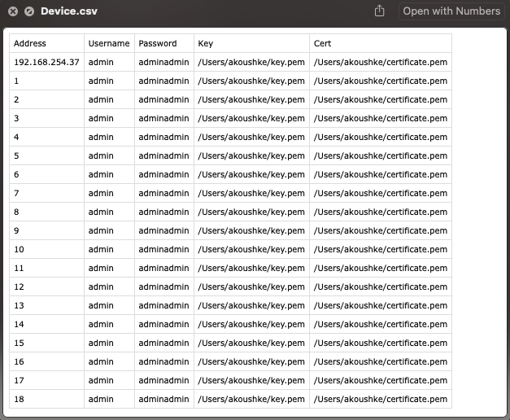

<!-- PROJECT LOGO -->
<br />
<p align="center">
  <h2 align="center">Device Certificate Manager</h2>

  <p align="center">
  Connect and Enable Third Party Service Certificates On Devices With a Desktop App 
    <br />
    <a href="https://github.com/WXSD-Sales/Devices-Manager"><strong>Explore the docs »</strong></a>
    <br />
    <br />
    <a href="https://github.com/WXSD-Sales/Devices-Manager/releases">View Releases</a>
    ·
    <a href="https://github.com/WXSD-Sales/Devices-Manager/issues">Report Bug</a>
    ·
    <a href="https://github.com/WXSD-Sales/Devices-Manager/issues">Request Feature</a>
  </p>
</p>

*_Everything included is for demo and Proof of Concept purposes only. Your use of the site is solely at your own risk. This site may contain links to third party content, which we do not warrant, endorse, or assume liability for. These demos are for Cisco Webex usecases, but are not Official Cisco Webex Branded demos._

<!-- TABLE OF CONTENTS -->
<details open="open">
  <summary>Table of Contents</summary>
  <ol>
    <li>
      <a href="#about-the-project">About The Project</a>
      <ul>
        <li><a href="#built-with">Built With</a></li>
      </ul>
    </li>
    <li>
      <a href="#getting-started">Getting Started</a>
      <ul>
        <li><a href="#installation">Installation</a></li>
      </ul>
    </li>
    <li><a href="#contributing">Contributing</a></li>
    <li><a href="#license">License</a></li>
    <li><a href="#contact">Contact</a></li>
  </ol>
</details>

<!-- ABOUT THE PROJECT -->

## About The Project

[](link)

### How to use

The executables to install the app locally are available [here]( https://github.com/WXSD-Sales/Devices-Manager/releases) for you to download.
In this demo we show how to add and enable service certificates to Webex devices. In order to test this POC successfully, You need to follow the steps below:

 - There must be Webex Device (Desk Mini or Room Devices) available in the same network that you are running this app in
 - This app requires CSV file which contains the following information:
   - Device Internal IP Address, Username and Password
   - Paths to Certificate and Key PEM files
     - Click [here](https://www.suse.com/support/kb/doc/?id=000018152) to learn more on how to create a pair of private certificate and key.
   - CSV file MUST contain the following format displayed in the picture:
   
### Depdencies

- [Webex Browser SDK](https://github.com/webex/webex-js-sdk)
- [React](https://reactjs.org)
- [RoomOS API](https://roomos.cisco.com/)
- [Electron](https://www.electronjs.org/)

<!-- GETTING STARTED -->

## Getting Started

If you would like to contribute to our source code and to improve our demo, please follow the steps mentioned below:

### Installation

1. Clone the repo
   ```sh
   git clone https://github.com/WXSD-Sales/Devices-Manager.git
   ```
2. We use NVM to manage our node.js machine versioning. You can learn more about NVM [here](https://github.com/nvm-sh/nvm)
   ```sh
   nvm use
   ```
3. Install the packages via [Yarn](https://classic.yarnpkg.com/en/)
   ```sh
   yarn
   ```
4. Start the server
   ```sh
   yarn dev
   ```

<!-- CONTRIBUTING -->

## Contributing

Contributions are what make the open source community such an amazing place to be learn, inspire, and create. Any contributions you make are **greatly appreciated**.

1. Fork the Project
2. Create your Feature Branch in your forked repo (`git checkout -b myrepo/AmazingFeature`)
3. Commit your Changes (`git commit -m 'Add some AmazingFeature'`)
4. Push to the Branch (`git push origin myrepo/AmazingFeature`)
5. Open a Pull Request

<!-- LICENSE -->

## License

Distributed under the MIT License. See `LICENSE` for more information.

<!-- CONTACT -->

## Contact

wxsd@cisco.external.com

<!-- MARKDOWN LINKS & IMAGES -->
<!-- https://www.markdownguide.org/basic-syntax/#reference-style-links -->

[contributors-shield]: https://img.shields.io/github/contributors/WXSD-Sales/Devices-Manager.svg?style=for-the-badge
[contributors-url]: https://github.com/WXSD-Sales/Devices-Manager/graphs/contributors
[forks-shield]: https://img.shields.io/github/forks/WXSD-Sales/Devices-Manager.svg?style=for-the-badge
[forks-url]: https://github.com/WXSD-Sales/Devices-Manager/network/members
[stars-shield]: https://img.shields.io/github/stars/WXSD-Sales/Devices-Manager.svg?style=for-the-badge
[stars-url]: https://github.com/WXSD-Sales/Devices-Manager/stargazers
[issues-shield]: https://img.shields.io/github/issues/WXSD-Sales/Devices-Manager.svg?style=for-the-badge
[issues-url]: https://github.com/WXSD-Sales/Devices-Manager/issues
[release-shield]: https://img.shields.io/github/package-json/v/WXSD-Sales/Devices-Manager
[release-url]: https://github.com/WXSD-Sales/Devices-Manager/releases
[license-shield]: https://img.shields.io/github/license/WXSD-Sales/Devices-Manager.svg?style=for-the-badge
[license-url]: https://github.com/WXSD-Sales/Devices-Manager/blob/master/LICENSE.txt
[linkedin-shield]: https://img.shields.io/badge/-LinkedIn-black.svg?style=for-the-badge&logo=linkedin&colorB=555
[linkedin-url]: https://www.linkedin.com/in/arash-koushkebaghi-9b1701a4/
[product-screenshot]: assets/images/presence.png
